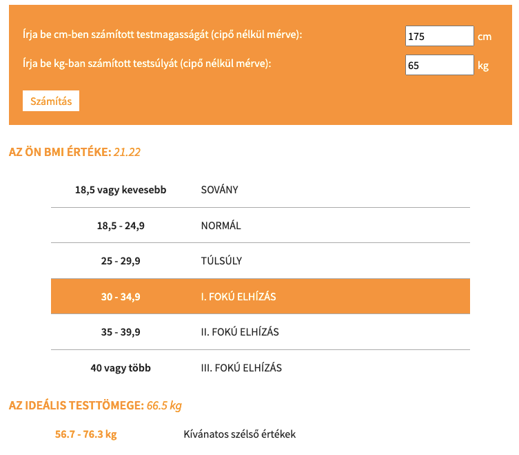

# [Név]

## Hogyan kezdj neki?

1. Jelentkezz be a GitHub szolgáltatásába a böngésződben és a VSCode szerkesztőben
2. A böngészőben forkold ezt a repository-t
3. A Settings > Pages oldalon a Source értékét állítsd gh-pages-re és mentsd el (Save)
4. Clone-ozd a saját(!) repodat a VSCode-ba
5. Írd át a Readme.md elején a [Név] részt a saját nevedre, majd commitolj és pusholj.
6. Az index.html fájlba készítsd el a munkádat! Az index.html fájlt tetszőlegesen átírhatod.

## Hogyan dolgozz?

A főbb pontokon commitolj és pushold fel a változtatásokat. Ezt érdemes minél sűrűbben megtenni, hisz így adod majd be a feladatot.

## Hogyan fejezd be?

Add be a repod linkjét. Figyelj oda, hogy az utolsó commit idejét fogjuk nézni.

# Feladat

Készíts egy weboldalt, ahol a felhasználó megadhatja a testmagaságát centiméterben és a súlyát kilógrammban. A számol gomb hatására a program számolja ki a BMI indexét a következő képlettel:

BMI = testsúly / (magasság / 100) ** 2

A BMI értelmezését lásd az alábbi képen, mely egyben a weboldal kinézetét is megmutatja.
A BMI indexét jelenítsd meg szöveggel valamint egy táblázatban is (ld. kép)

+feladat
Készítsd el úgy az egész kódodat(HTML, CSS, JS), hogy bármilyen weboldalba beszúrható legyen és működjön.

